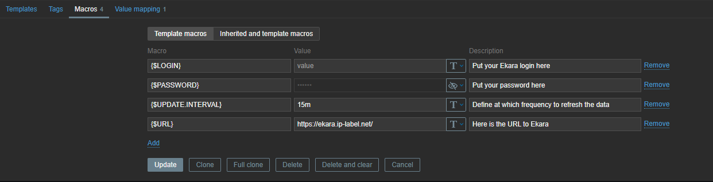
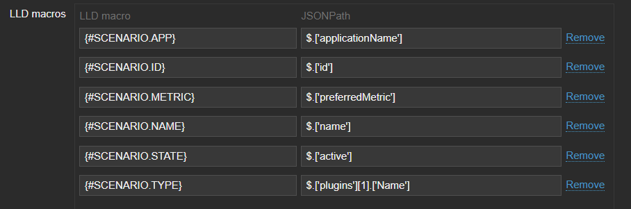
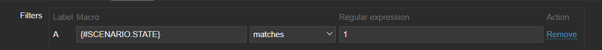
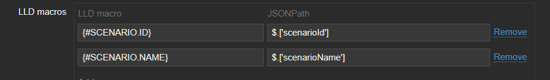

# Zabbix Ekara Template

## Overview

Ekara is a fully hybrid platform, capable of monitoring 100% of existing applications and ensuring the availability and performance of your environment (intranet and internet).
Ekara robots execute scenarios (user journeys) according to a predefined schedule.
The scenario results are the scenario status and the duration of every step as well as browser's metrics for Web applications.

The Zabbix Ekara Template is useful for real_time monitoring. For user journeys (scenarios) configuration and a deepen analysis, access the Ekara Portal directly.
The template is designed to interface with Ekara APIs to display in customized dashboards :
* Scenarios statuses,
* Trigger problem event based on scenario status,
* Get observability KPIs (performance and availability),

## Setup

### Import the template

*Data collection -> Templates -> Import*

### Fill up these macros

*Select the template*

### Assign the template to a host

*Data collection -> Hosts -> Select host and assign template*

That host will have items, triggers and graphs created automatically for each scenarios.

### Enjoy (and wait)  

## Zabbix configuration

You can also modify the {$UPDATE.INTERVAL} macro, which is the number of minutes between each API call for metrics retrieval.  

## Template links

There are no template links in this template.  

## Discovery rules

### Set Ekara items discovery

|Name|Description|Type|Key|
|-|-|-|-|
|Set Ekara items|This will discover the metrics for each scenarios.|`Dependent Item`|set.ekara.items|

**LLD Macros**

**Filters**

  

**Items prototype**

|Name|Description|Type|Key|Update Interval|Preprocessing|
|-|-|-|-|-|-|
|{#SCENARIO.NAME}: results|This script call the API to gather the results for each scenarios.|`Script`|get.scenarios.results[{#SCENARIO.ID}]|{$UPDATE.INTERVAL}|-|
|{#SCENARIO.NAME}: availability|This item preprocesses the JSON to get the availability of the scenario.|`Dependent Item`|get.scenarios.availability[{#SCENARIO.ID}]|-|`$.kpis[?(@.label=='availability')].value.first()`|
|{#SCENARIO.NAME}: {#SCENARIO.METRIC}|This item preprocesses the JSON to get the metric of the scenario if available.|`Dependent Item`|get.scenarios.metric[{#SCENARIO.ID}]|-|`$.kpis[?(@.label=='{#SCENARIO.METRIC}')].value.first()`|
  

### Set Ekara status items

|Name|Description|Type|Key|
|-|-|-|-|
|Set Ekara status items|This will discover the status for each scenarios.|`Dependent Item`|set.ekara.status.items|

**LLD Macros**

**Items prototype**

|Name|Description|Type|Key|Update Interval|Preprocessing|
|-|-|-|-|-|-|
|{#SCENARIO.NAME}: status|This item get the status of the scenario.|`Dependent Item`|get.scenarios.statuses[{#SCENARIO.ID}]|-|`$[?(@.scenarioId=='{#SCENARIO.ID}')].currentStatus.first()`|

**Triggers prototype**

|Name|Description|Expression|Severity|
|-|-|-|-|
|{#SCENARIO.NAME}: is status Success ?|This will be created for each scenarios and trigger a problem if the scenario's status isn't successful.|`last(/Ekara Template Dev v2/get.scenarios.statuses[{#SCENARIO.ID}])<>1`|Average|
  

## Feedback

Please report any issues with the template at [https://support.zabbix.com](https://support.zabbix.com/)

You can also provide feedback, discuss the template, or ask for help at [ZABBIX forums](https://www.zabbix.com/forum/zabbix-suggestions-and-feedback)
