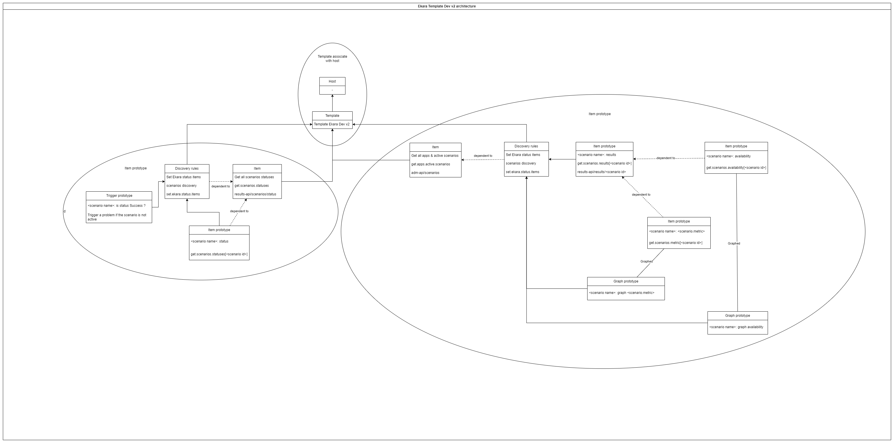

# Ekara Template

## Architecture

Second version:
This version has two items and discovery rules
* One has the status of the scenarios
* The other has the rest
* Only one item will be created for the metric

